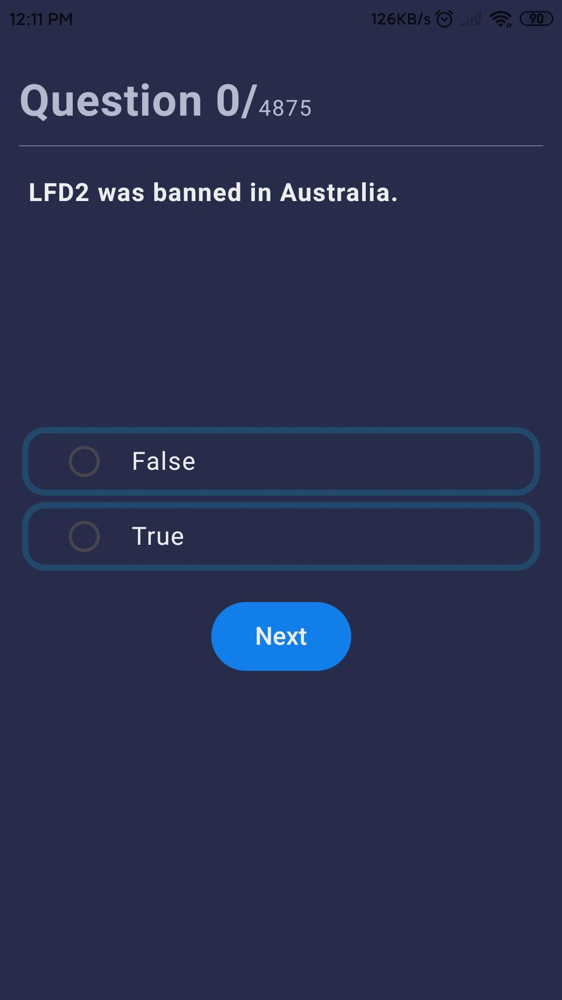
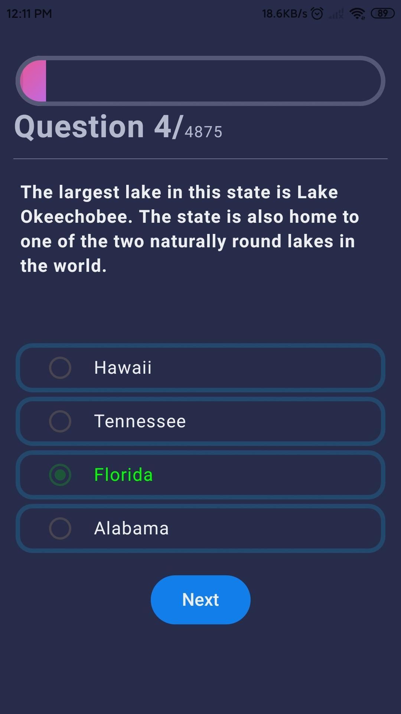
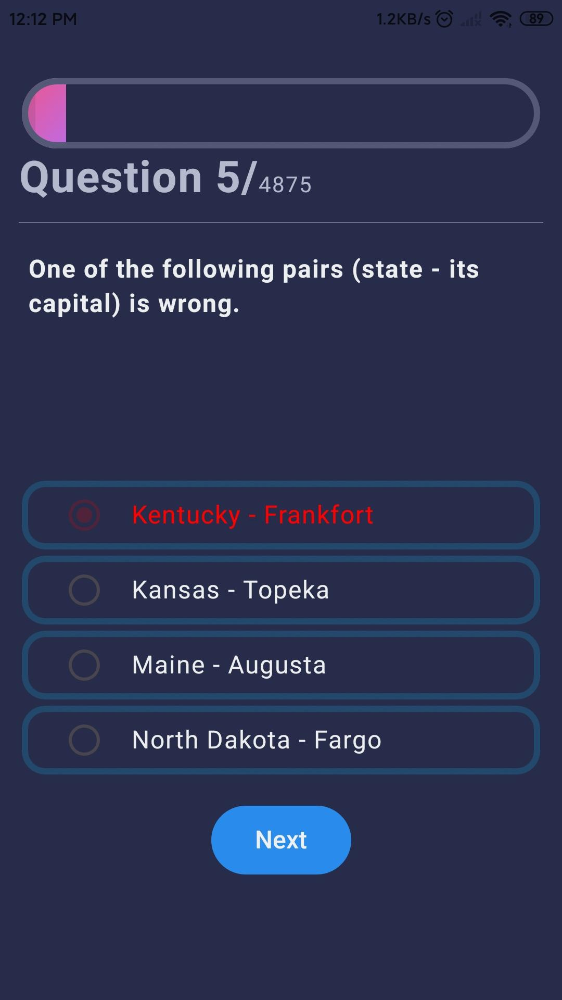
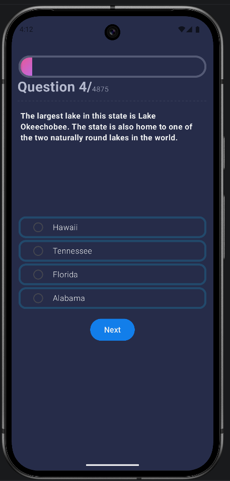

# JetTrivia

A simple Android quiz application built with **Jetpack Compose** to demonstrate modern Android
development concepts.

## What You'll Learn

- **Clean Architecture**
- **JSON Parsing with Retrofit**
- **UI Design using Jetpack Compose**

## Tech Stack

- Kotlin
- Jetpack Compose
- Retrofit
- Kotlin Coroutines
- Material 3

## Screenshots

  
  
  

  

This project is for learning and educational purposes.
